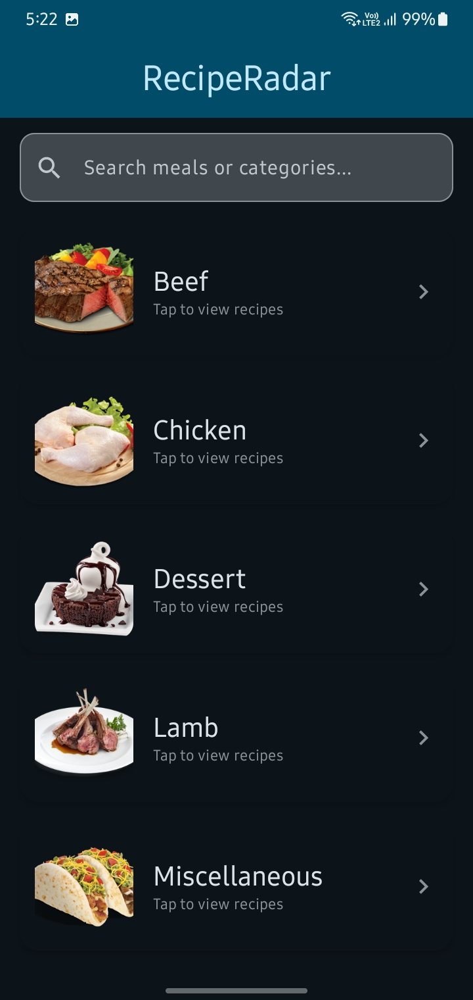
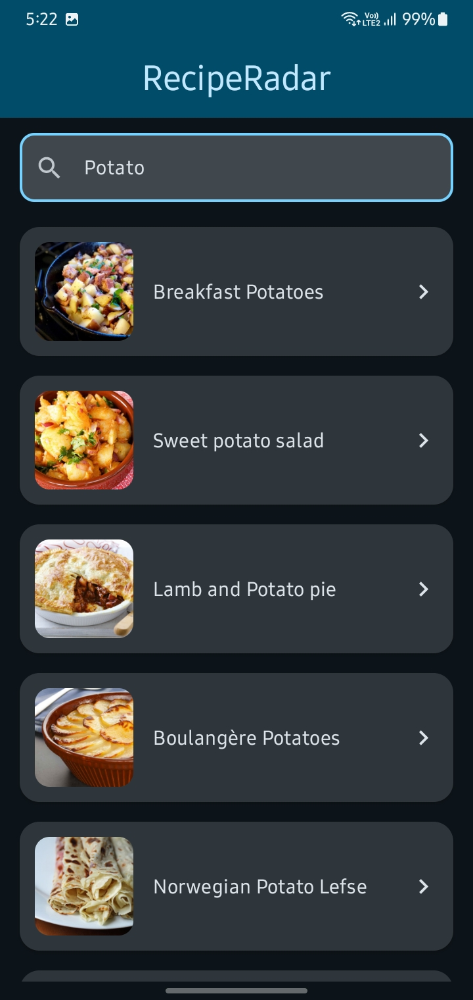
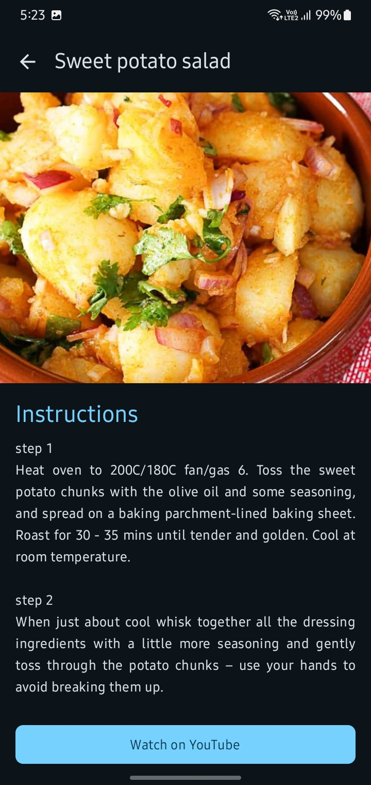
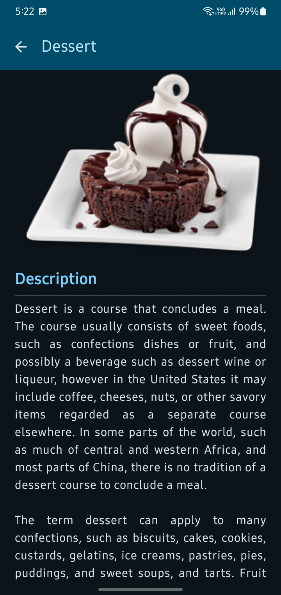

# RecipeRadar 🍳

**RecipeRadar** is an Android app built using **Jetpack Compose** and **MVVM Architecture**. It helps users explore recipes, search meals, and view detailed cooking instructions. This project shows my understanding of API integration, clean architecture, and modern Android UI.

---

## 🏗 Architecture (MVVM)
The project is structured in a clean and organized way:

* **data**: Handles API calls using Retrofit and manages network responses.
* **model**: Contains data classes for Category and Meal.
* **viewmodel**: Manages UI state using StateFlow and handles background tasks with Coroutines.
* **presentation**: UI built with Jetpack Compose and navigation between screens.

---

## 🚀 Features
* Fetch food categories from API
* Search meals in real-time
* View recipe details and instructions
* Smooth navigation between screens
* Fast image loading using Coil

---

## 🛠 Tech Stack
* **Language:** Kotlin  
* **UI:** Jetpack Compose (Material 3)  
* **Architecture:** MVVM  
* **Networking:** Retrofit + Gson  
* **Async:** Coroutines & StateFlow  
* **Image Loading:** Coil  
* **Navigation:** Compose Navigation  

---

## 📸 Preview
  
 

---

## 📥 How to Run
1. Clone the repository:
   ```bash
   git clone https://github.com/Anisha956/RecipeRadar.git

2. Open in Android Studio
3. Make sure internet is ON (API is used)
4. Run the app on emulator or device   
